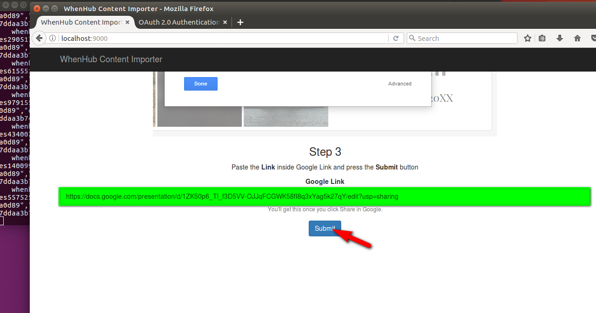

# import-googledrivefile-to-whenhub
> Deployment Guide

## Introduction
This app gives WhenHub a way to expand the audience or user base as this app is for importing content into the platform then to visualize it and share it using WhenHub. The way I think that this can be accomplished is to help users ways to import existing content (in this specific case, Google Docs presentations) into WhenHub. One of the main benefits offered to the user is that the app imports images taken from the presentation so the original Google content remains protected from being imported in some forms of document sources (PowerPoint, PDF, along with other vector formats).

I chose to implement for Google as the usage stats across the Globe (Alexa) shows:
Alexa Global Rank (as of apr 26)

The app was developed on Windows OS, instructions are given for Linux as this is standard platform for serving web apps.

1. google.com, ranked 1
2. slideshare.net, 144
3. canva.com, 442
4. prezi.com, 455

This guide structure:

- Authenticate with Google
- Authenticate with Amazon S3
- Cloning the repo
- Installing required software
- Running the app
- Verification
- Future work

## Authenticate with Google

In the case of Google Drive, the app credential file is stored inside the source code and you don't need to do anything in order to make it work.

## Authenticate with Amazon S3

This app uses Google Drive and Amazon S3 services.

Create a user in Amazon IAM [https://console.aws.amazon.com/iam](https://console.aws.amazon.com/iam) if you don’t have one. Here you will get an "Access key" and "Secret Access Key". You will need these credentials to connect to S3.

Add the "AWSConnector" and "AmazonS3FullAccess2 permissions in IAM to your new user. Without this you won't be able to authenticate with the server.

Use the default credential profiles file – this is the recommend way by Amazon. Create a file with following structure and fill in the access keys:
<pre>
    # Move this credentials file to (~/.aws/credentials)
    # after you fill in your access and secret keys in the default profile
    # WARNING: To avoid accidental leakage of your credentials,
    #          DO NOT keep this file in your source directory.
    [default]
    aws_access_key_id=
    aws_secret_access_key=
</pre>

## Cloning the repo 

Git clone the repo.
<pre>
$ git clone &lt;dir&gt;
</pre>

## Installing required software

Install OpenJDK.
<pre>
$ sudo apt install openjdk-8-jdk-headless
</pre>

Install gradle
<pre>
$ sudo apt install gradle
Reading package lists... Done
Building dependency tree       
Reading state information... Done
The following additional packages will be installed:
  ant ant-optional antlr aspectj bnd ca-certificates-java default-jre
(more lines...)
</pre>

## Running the app

Build the web server.
<pre>
$ gradle stage
</pre>

Launch the server.
<pre>
$ java -Dserver.port=9000 -jar build/libs/import-googledrivefile-to-whenhub-all-1.0.jar com.whenhub.importer.Main
</pre>

Browse to [http://localhost:9000/](http://localhost:9000/), scroll down to Step 3, and paste a Shared Link from a Google docs presentation inside the textbox. Press "Submit" button.

You'll be asked for your Google Credentials for authorizing this app to fetch data from Google docs. This can be checked in the console as it says that a new browser tab will open that allows to sign in (if not signed in) and the said authorization. Once you authorized the app, switch to the app and wait a few moments to complete the process. Again, the progress can be seen in the console or the browser tab (you'll see an informative message at the end).  

Please feel free to use any of these shared links for testing:

- Lookbook [https://docs.google.com/presentation/d/1ZK50p6_Tl_f3D5VV-OJJqFCGWK58fI8q3xYag5k27qY/edit?usp=sharing](https://docs.google.com/presentation/d/1ZK50p6_Tl_f3D5VV-OJJqFCGWK58fI8q3xYag5k27qY/edit?usp=sharing)
- Portfolio [https://docs.google.com/presentation/d/1e3rofZLUdOj3FIrQZwd4YMFAT5nPJdQN49rORrTUsNc/edit?usp=sharing](https://docs.google.com/presentation/d/1e3rofZLUdOj3FIrQZwd4YMFAT5nPJdQN49rORrTUsNc/edit?usp=sharing) 
- PhotoAlbum [https://docs.google.com/presentation/d/1EdGQZlIg-KAIpz3zDeozmv6EJF-d9kEoDA0Vu8q6PO0/edit?usp=sharing](https://docs.google.com/presentation/d/1EdGQZlIg-KAIpz3zDeozmv6EJF-d9kEoDA0Vu8q6PO0/edit?usp=sharing)

## Verification

Browse to [https://studio.whenhub.com/](https://studio.whenhub.com/) to verify that the contents and its images are created.

Sample output during import process:
<pre>
Credentials saved to /home/dev1/.credentials/drive-java-quickstart
File: Lookbook Id: (1ZK50p6_Tl_f3D5VV-OJJqFCGWK58fI8q3xYag5k27qY) Kind: null 
Exporting presentation: Lookbook
   download link https://s3.amazonaws.com/generatedpdf/whenhub-images5674938789450186206.png
   download link https://s3.amazonaws.com/generatedpdf/whenhub-images2905137874787398283.png
   download link https://s3.amazonaws.com/generatedpdf/whenhub-images6155511603106253953.png
   download link https://s3.amazonaws.com/generatedpdf/whenhub-images979155880683719155.png
   download link https://s3.amazonaws.com/generatedpdf/whenhub-images4340023026647097014.png
   download link https://s3.amazonaws.com/generatedpdf/whenhub-images1400993263696646467.png
   download link https://s3.amazonaws.com/generatedpdf/whenhub-images5575257358426718665.png
   whenhub me response: {"displayName":"XYZ","photo":"https://lh6.googleusercontent.com/-9-YZS6ymxJs/AAAAAAAAAAI/AAAAAAAABPY/1D39nuIZ04A/photo.jpg?...}

...

   whenhub create schedule response: id: 59085e758b14cb14903a0d87
   whenhub create event response: {"when":{"period":"minute","startDate":"2017-05-02T10:24:55Z","startTimezone":"America/New_York","endDate":null,"endTimezone":"America/New_York"},"name":"Slides","description":"Exported slides","id":"59085e768b14cb14903a0d89","createdAt":"2017-05-02T10:24:54.000Z","updatedAt":"2017-05-02T10:24:54.000Z","createdBy":"58f9b637c7ddaa3b7464e0a3","updatedBy":"58f9b637c7ddaa3b7464e0a3","scheduleId":"59085e758b14cb14903a0d87"}
   event: id: 59085e768b14cb14903a0d89

</pre>

## Future work
Ability to sync additional content types could be a major improvement for future versions. I wanted to do the same for slideshare but they don't offer a programming API for the purpose of importing contents from their platform.
